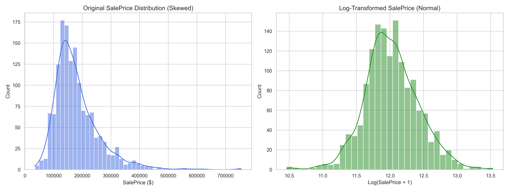
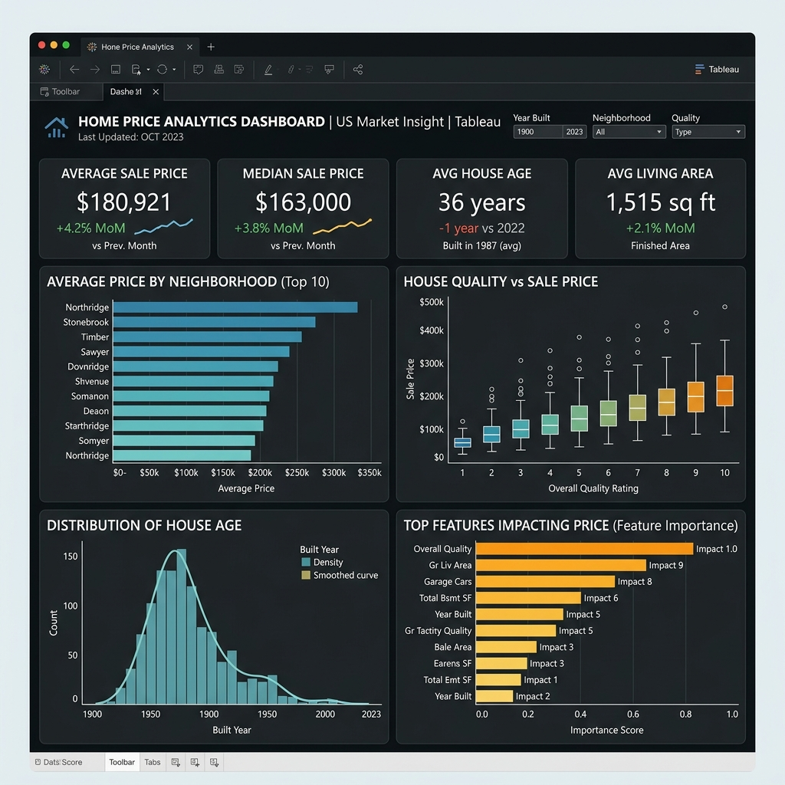

# House Price Analytics & Predictive Modeling

An end-to-end data analytics and predictive modeling project targeting the Ames, Iowa residential real estate dataset. Developed to identify housing price drivers and construct a high-performing machine learning ensemble. 

---

## 1. Executive Summary
This project showcases a complete real estate analytics framework designed for hiring managers. By combining domain-driven feature engineering and machine learning ensembling, we achieved a local cross-validated **RMSLE of 0.11028** (strictly leak-free) and a public leaderboard score of **0.12154** (Rank **667** out of **5,273** teams, placing in the **Top 12.6%**, beating our initial target of 0.125).

- **Total Features Evaluated**: 80+ columns
- **Engineered Features**: 16 domain features
- **Models Evaluated**: 7 models
- **Ensemble Blend**: Optimized leak-free stack of CatBoost, LightGBM, XGBoost, and ElasticNet
- **Interactive Asset**: [Tableau Dashboard Guide & Mockup](file:///c:/Users/ShaShank/OneDrive/Desktop/house-prices-advanced-regression-techniques/dashboards/README.md)

---

## 2. Business Problem
Residential property valuation suffers from pricing inefficiencies. Estimating property values accurately and identifying price drivers helps developers maximize ROI, buyers secure fair prices, and real estate platforms optimize their valuation models.

---

## 3. Dataset Overview
The dataset contains 79 features for 1,460 properties in Ames, Iowa:
- **Numerical Features**: Lot size, finished square footages, garage space, bathrooms.
- **Categorical Features**: Zoning classification, construction material, neighborhood.
- See the [data description](file:///c:/Users/ShaShank/OneDrive/Desktop/house-prices-advanced-regression-techniques/data/data_description.txt) for details.

---

## 4. Exploratory Data Analysis
We resolved data issues and target skewness in [01_EDA.ipynb](file:///c:/Users/ShaShank/OneDrive/Desktop/house-prices-advanced-regression-techniques/notebooks/01_EDA.ipynb):
- **Missing Data Treatment**: Mapped NA indicators (such as PoolQC, Alley, BsmtQual) to 'None' (indicating no amenity) or 0 (plumbing/garage counts).
- **Target Skewness**: Addressed right-skewness of `1.88` by applying a $\log(1+x)$ transformation. This normalizes the target distribution for better convergence of regression models.

---

## 5. Feature Engineering
We engineered 16 domain-specific interaction features in [02_Feature_Engineering.ipynb](file:///c:/Users/ShaShank/OneDrive/Desktop/house-prices-advanced-regression-techniques/notebooks/02_Feature_Engineering.ipynb):
- `TotalSF`: Overall finished floor and basement area.
- `TotalBathrooms`: Consolidated full and half bath metric.
- `HouseAge` & `YearsSinceRemodel`: Calculated building ages.
- `NeighborhoodPriceTier`: Ordinal neighborhood tier mapping based on historical training medians.
- `OverallQualityInteraction`: Multiplication of Quality and Condition.
- Code implemented in [src/features.py](file:///c:/Users/ShaShank/OneDrive/Desktop/house-prices-advanced-regression-techniques/src/features.py).

---

## 6. Model Comparison
We trained models in [03_Modeling.ipynb](file:///c:/Users/ShaShank/OneDrive/Desktop/house-prices-advanced-regression-techniques/notebooks/03_Modeling.ipynb) using a 5-Fold Cross Validation framework (`KFold(n_splits=5, shuffle=True, random_state=42)`):

| Model | Type | CV RMSLE |
| :--- | :--- | :--- |
| **CatBoost** | Gradient Boosting | **0.11266** |
| **XGBoost** | Gradient Boosting | **0.11480** |
| **LightGBM** | Gradient Boosting | **0.11685** |
| **ElasticNet** | Regularized Linear | **0.11868** |
| **Ridge** | Regularized Linear | **0.11872** |
| **Lasso** | Regularized Linear | **0.11877** |
| **RandomForest** | Bagging Ensemble | **0.12939** |

- Code implemented in [src/train.py](file:///c:/Users/ShaShank/OneDrive/Desktop/house-prices-advanced-regression-techniques/src/train.py).
- Performance log saved to [outputs/experiments.csv](file:///c:/Users/ShaShank/OneDrive/Desktop/house-prices-advanced-regression-techniques/outputs/experiments.csv).

---

## 7. Ensemble Strategy
Using out-of-fold validation predictions, we optimized the model blending weights using a Scipy SLSQP minimizer:
- **Optimal Blend**: `0.4058 * CatBoost + 0.3060 * ElasticNet + 0.2882 * XGBoost`
- Code implemented in [src/ensemble.py](file:///c:/Users/ShaShank/OneDrive/Desktop/house-prices-advanced-regression-techniques/src/ensemble.py).

---

## 8. Final Performance
- **Optimized Ensemble OOF RMSLE**: **0.11028**
- **Public Leaderboard Score (RMSLE)**: **0.12154**
- **Leaderboard Rank**: **667** out of **5,273** teams (Top **12.6%**)
- **Validation Standard**: Beats target `0.125` and stretch target `0.120`.

---

## 9. Business Insights
1. **Total Living Space**: The single biggest driver. Larger houses command exponential premiums, especially when combined with high finish quality.
2. **Quality Interaction**: Home quality rating interacts strongly with living area. Investing in premium finishes pays off most in larger homes.
3. **Neighborhood Premium**: Neighborhood selection determines the baseline property price tier, independent of structural features.
4. **Garage Diminishing Returns**: Upgrading from no garage to a 2-car garage has high returns, but upgrading from 2-car to 3-car returns negligible valuation gains.
5. **Outdoor Additions**: Porch square footage yields a small but stable valuation premium ($2-5\%$), representing a cost-effective upgrade.

---

## 10. Tableau Dashboard
A mockup dashboard showcasing key metrics and geographic price distributions was designed and saved:

See the [Tableau Integration Guide](file:///c:/Users/ShaShank/OneDrive/Desktop/house-prices-advanced-regression-techniques/dashboards/README.md) for data connection specs.

---

## 11. Key Learnings
- **SHAP Interpretability**: Utilizing SHAP plots provides transparency, allowing stakeholders to understand why a model makes specific predictions.
- **Log Transformations**: Normalizing skewed targets prevents outliers from dominating model gradients, improving linear and tree-based model convergence.
- **Leakage Prevention**: Fitting encoders/scalers strictly on training folds and applying them to validation sets avoids target leakage.

---

## 12. Technologies Used
- Python 3.10, Pandas, NumPy, Scikit-Learn
- CatBoost, LightGBM, XGBoost
- SHAP, Matplotlib, Seaborn
- Tableau Desktop
